# Cloud Integration Project
Maxime LARROZE 'MLJDLR'  
Thomas MIRAS GARCIA 'Vamlack'    
---

Table of Contents

[1. CRUD - Create](#create)  
[2. CRUD - Read](#read)  
[3. CRUD - Update](#update)  
[4. CRUD - Delete](#delete)  
[5. Docker - Image](#image)  

---

  
  
# 1. CRUD - Create

Here are our 5 students at the beginning :
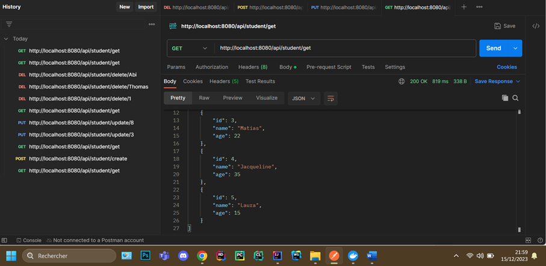   

We create a new one (john doe, 25) :
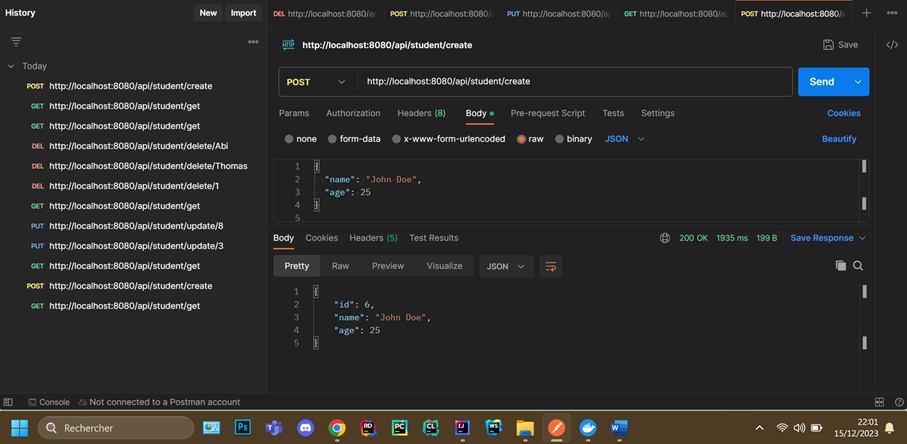   

And here we can see the new student :
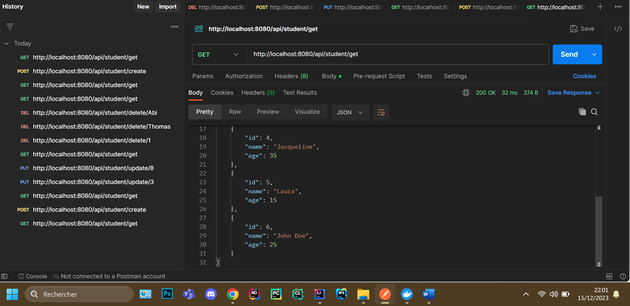   

---

  
# 2. CRUD - Read

Here same as in the Postman app, we can see our 6 students :
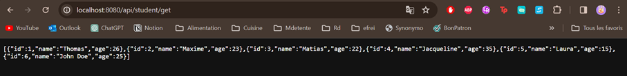   

---

  
# 3. CRUD - Update

We update student (id = 3) and we can see it was done :
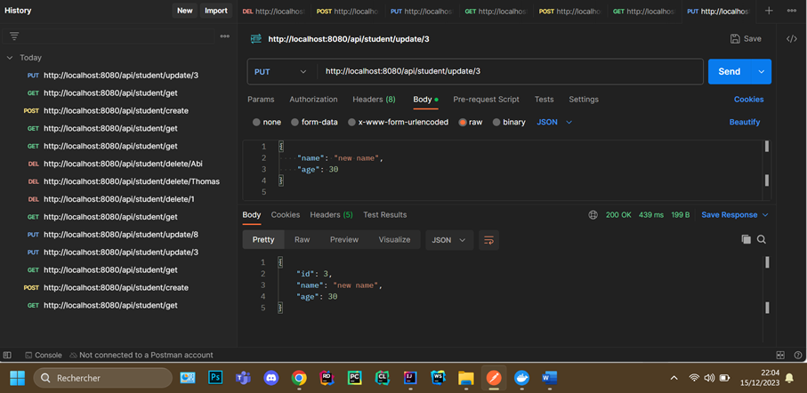   

When we try to update on a non-existing student (id not in database), nothing happens :
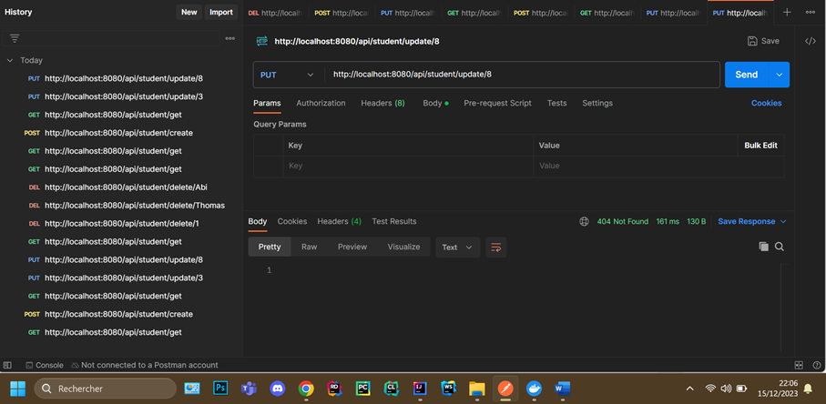   

And we can see in our local server that student (id 3) has a new name & age, nothing happened for the update on student (id 8) because this id doesn’t exist :
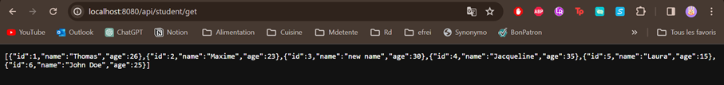   

---

  
# 4. CRUD - Delete

Here we delete student named “Thomas”, we have confirmation (inputted in our code as such) :
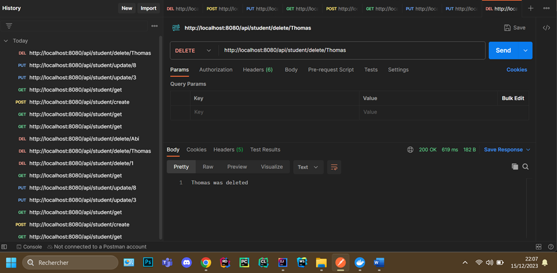   

And when we try on a student not in the database we can see that it doesn’t work and it displays “student doesn’t exist” (same as before we inputted as such in our code)
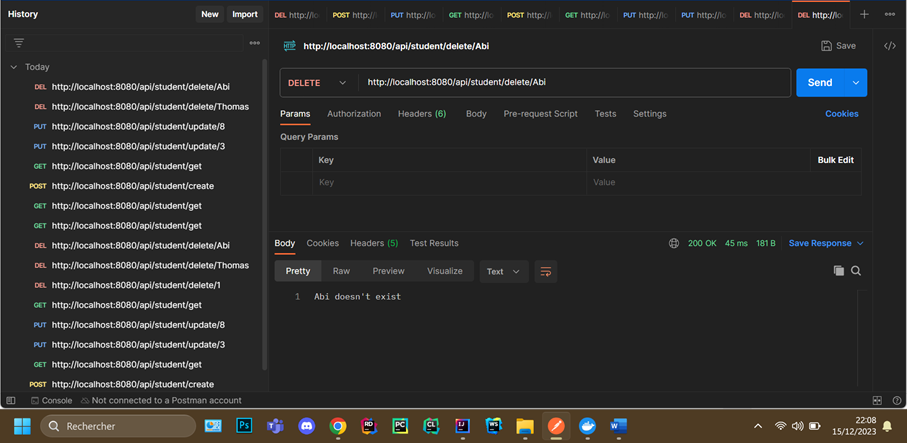   

Finally, we can see by doing a get (here in local server but same in postman) that student Thomas was deleted and no issue occurred because Abi doesn’t exist as a student :
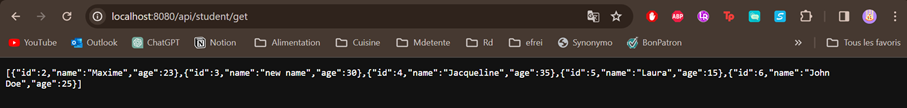   

---

  
# 5. Docker - Image

Launch docker :
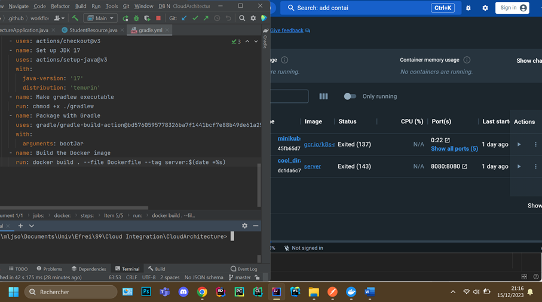   

